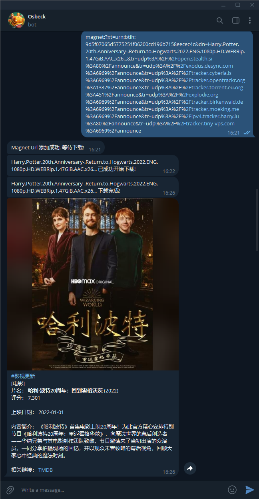

# Media-Download-Helper

完整部署教程请参考：[Media-Download-Helper 完整部署教程](./doc/Media-Download-Helper%20%E5%AE%8C%E6%95%B4%E9%83%A8%E7%BD%B2%E6%95%99%E7%A8%8B.md)

## 修订版本

| 修订版本 | 修订日期 | 修订内容 |
| :------: | :------: | :------ |
| v2.0.0 | 2024.03.05 | <li>修改架构，取消 http server，去除公网 ip 依赖</li><li>更新 v2.000.0 版本</li> |
| ~~v1.1.0~~ | ~~2024.02.27~~ | ~~<li>取消sendMessage接口text字段格式为markdown限制，修复部分下载文件名称字符串过长自动省略后不符合markdown规范导致的sendMessage接口返回失败问题</li><li>增加TMDBQuery中caption拼接字符串时‘r’前缀声明，避免在某些版本(例如python3.12)中被默认转义</li><li>新增dockfile和对应的docker-compose.yml，该compose在`Ubuntu 20.04.6 LTS x86_64`环境下测试正常</li>~~ |
| ~~v1.0.0~~ | ~~2024.02.26~~ | ~~<li>新增项目，完成各模块开发，实现项目功能</li>~~ |

## V2.0.0 版本更新说明

> 鉴于公网 IP 难以获取，而且将内部服务直接暴露到公网环境，安全系数较低，部署难度较大等几个原因，因此在 v2.0.0 版本中，取消了 http server 模块，由 media download helper 直接向 Google Apps Script 主动发起 get 请求进行轮询获取磁力链接信息。去除了公网 ip 的依赖，提高安全性的同时也增加了部署的便利性。
>
> 当然，v2.0.0 并非完美的方案，它同样存在着弊端，就是轮询请求 Google Apps Script 部署的在线 Web 应用的间隔不好把控。目前版本设置的轮询间隔为 1 分钟，这也就意味着 Google Apps Script 的 web 应用一天需要相应 1440 次请求，如果可以，请考虑使用更长的轮询间隔，避免薅羊毛过狠导致后期不可用的情况出现。
>
> 还有一点，v2.0.0 版本中，Google Apps Script 仅仅通过脚本属性字段来缓存接收到的 post 数据，这里也存在着未知的风险。
>
> 如果条件允许的情况下，还是推举使用 v1.x.x 版本，由 google apps script 响应 post 请求时，直接将数据推送到 Media Download Helper 内置的 http server，避免了缓存和并发的问题。
>
> 当然，轻度使用场景下，v2.0.0 版本也是可以接受的。

## 开发目的

玩个人影视服务器的朋友，应该都知道 Jeckett，Sonarr，Radarr 这些自动下载工具，只要我添加了对应的 PT 站，它们就能根据提交的请求进行检索下载。但是部分资源可能不在 PT 站，尤其是部分生肉，外网的磁力链接发布的更快一些，例如 TG 上的一些频道。Radarr 和 Sonarr 不支持直接使用磁力链接进行下载，在外也不方便使用这些内网的服务。

再者有部分朋友也不想弄 PT 和上面说的那些服务，只是偶尔有部分资源想下载下来观看一下，完整部署自动化追剧工具就显得有点大材小用了。

所以才想开发一个小工具，借助免费的工具就可以实现在外远程进行下载，同时还可以在下载完成后通过电报机器人推送影片信息，方便查看下载信息。

## 项目简介

**"Media Download Helper"** 是一个基于电报机器人，Google Apps Script 和 qbittorrent 的多媒体下载助手。

用户可通过向 tg bot 发送影片的磁力链接，通过部署的 Google Apps Script 在线 web 应用转发至 Media Download Helper。Media Download Helper 将通过 qbittorrent web API 下载该磁力链接，并支持查重功能，根据磁链中的 hash 值判重，如果 qbittorrent 中已存在该 hash 值的 torrent，则不再重复下载，通过 tg bot 返回 “xxxxxx 已存在，请勿重复下载”给用户。

除了提供下载功能以外，Media Download Helper 还支持在下载完成后，根据磁力链接中的文件名，对 TMDB 数据库进行检索，将检索到的影片信息通过 tg bot 返回给用户，具体效果图可见[下方章节](#效果图)。( 说句题外话，这个推送的效果，本来是用在我另一个辅助 Emby 私人服务器针对入库影片进行推送发布消息的，感兴趣的朋友也可以试用一下，给点建议，项目地址：<https://github.com/Ccccx159/watchdog_for_Emby> )

## 各模块交互图

## 依赖项

仅在 Python 3.11 环境下测试通过：

+ python 3.11 (External module: requests, python-qbittorrent, colorlog)
+ Telegram Bot and it's Token (鉴于电报资源丰富，尤其 [@RarbgPro](https://t.me/RarbgPro)  频道发布的公开磁链，以及强大的 bot 功能，因此将用户交互客户端选择为 Telegram)
+ Google Apps Script (构建在线脚本，并注册为电报机器人的 webhook)
+ Qbittorrent with WebUI (磁链下载工具)
+ TMDB API Token (影视资源数据库，用于下载完成后进行检索，并传递相关信息给用户)

~~这里需要注意，`Simple Http Server` 是在局域网内部部署的服务，如果没有将其暴露到公网环境下，那么 `Google Apps Scrip` 的在线脚本则无法访问 `Simple Http Server` 。所以，在部署在线脚本时，需要将 `Simple Http Server` 暴露到公网环境下。（此处可能存在安全风险，建议使用 https 和 cdn 来提高安全系数）~~

完整部署教程请参考：[Media-Download-Helper 完整部署教程](./doc/Media-Download-Helper%20%E5%AE%8C%E6%95%B4%E9%83%A8%E7%BD%B2%E6%95%99%E7%A8%8B.md)

## 环境变量说明

| 环境变量 | 说明 |
| :------: | :-- |
| `QBIT_HOST` | Qbittorrent WebUI host 地址 |
| `QBIT_USER` | Qbittorrent WebUI username 用户名 |
| `QBIT_PASS` | Qbittorrent WebUI password 密码 |
| `BOT_TOKEN` | Telegram Bot Token |
| `TMDB_API_TOKEN` | TMDB API Token |
| `GOOGLE_APPS_SCRIPT_URL` | Googel Apps Script 部署的在线 web 应用网址 |
| `LOG_LEVEL` | (可选) 日志等级，默认 WARNING |
| `LOG_EXPORT` | (可选) 日志导出到文件，默认 False |
| `LOG_PATH` | (可选) 日志导出路径，默认 `/var/tmp/media_dlhelper_logs/` |

## 效果图

## 参考链接

+ [Telegram Bot API 说明](https://core.telegram.org/bots/api)
+ [Python Qbittorrent 接口文档](https://python-qbittorrent.readthedocs.io/en/latest/modules/api.html)
+ [Qbittorrent 官方 API 文档](https://github.com/qbittorrent/qBittorrent/wiki/)
+ [Telegram 机器人的申请和设置图文教程](https://www.dengnz.com/2020/11/23/telegram-%E6%9C%BA%E5%99%A8%E4%BA%BA%E7%9A%84%E7%94%B3%E8%AF%B7%E5%92%8C%E8%AE%BE%E7%BD%AE%E5%9B%BE%E6%96%87%E6%95%99%E7%A8%8B/)
+ [Telegram Bot 第一个回声机器人 – 你是汤姆猫吧[第二集]](https://www.dengnz.com/2018/09/05/telegram-bot-%e7%ac%ac%e4%b8%80%e4%b8%aa%e5%9b%9e%e5%a3%b0%e6%9c%ba%e5%99%a8%e4%ba%ba-%e4%bd%a0%e6%98%af%e6%b1%a4%e5%a7%86%e7%8c%ab%e5%90%a7%e7%ac%ac%e4%ba%8c%e9%9b%86/)
+ [TMDB API 说明文档](https://developer.themoviedb.org/reference/intro/getting-started)