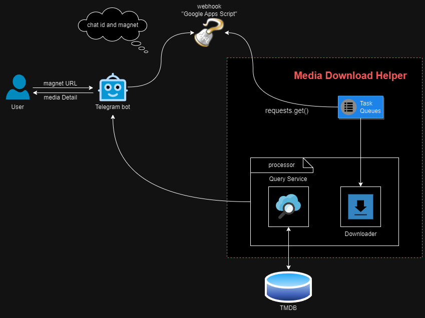

# Media-Download-Helper

## 修订版本

| 修订版本 | 修订日期 | 修订内容 |
| :------: | :------: | :------ |
| v1.001.0 | 2024.02.27 | <li>取消sendMessage接口text字段格式为markdown限制，修复部分下载文件名称字符串过长自动省略后不符合markdown规范导致的sendMessage接口返回失败问题</li><li>增加TMDBQuery中caption拼接字符串时‘r’前缀声明，避免在某些版本(例如python3.12)中被默认转义</li><li>新增dockfile和对应的docker-compose.yml，该compose在`Ubuntu 20.04.6 LTS x86_64`环境下测试正常</li> |
| v1.000.0 | 2024.02.26 | <li>新增项目，完成各模块开发，实现项目功能</li> |

## 项目简介

**"Media Download Helper"** 是一个基于电报机器人的多媒体下载助手。

通过部署在线脚本，并将其注册为电报机器人的 webhook，用户发送磁力链接给 bot 后，bot 通过 webhook 将消息转发至内部由下载助手创建的 simple http server ，下载助手解析出消息中的磁链后，使用 Qbittorrent WebUI 的 API 触发下载任务，并将下载任务的状态通过电报 bot 转发给用户。

下载完成后，下载助手将通过 TMDB API 查询下载资源的相关信息，并将信息转发给用户。

## 各模块交互图

## 依赖项

仅在 Python 3.11 环境下测试通过：

+ python 3.11 (External module: requests, python-qbittorrent)
+ Telegram Bot and it's Token (鉴于电报资源丰富，尤其 [@RarbgPro](https://t.me/RarbgPro)  频道发布的公开磁链，以及强大的 bot 功能，因此将用户交互客户端选择为 Telegram)
+ Google Apps Script (构建在线脚本，并注册为电报机器人的 webhook)
+ Simple Http Server (监听并接收 webhook 请求， 解析消息中的磁链并转发给 qbittorrent)
+ Qbittorrent with WebUI (磁链下载工具)
+ TMDB API Token (影视资源数据库，用于下载完成后进行检索，并传递相关信息给用户)

<mark>这里需要注意，`Simple Http Server` 是在局域网内部部署的服务，如果没有将其暴露到公网环境下，那么 `Google Apps Scrip` 的在线脚本则无法访问 `Simple Http Server` 。所以，在部署在线脚本时，需要将 `Simple Http Server` 暴露到公网环境下。（此处可能存在安全风险，建议使用 https 和 cdn 来提高安全系数）</mark>

## 环境变量说明

| 环境变量 | 说明 |
| :------: | :--: |
| `QBIT_HOST` | Qbittorrent WebUI host |
| `QBIT_USER` | Qbittorrent WebUI username |
| `QBIT_PASS` | Qbittorrent WebUI password |
| `BOT_TOKEN` | Telegram Bot Token |
| `TMDB_API_TOKEN` | TMDB API Token |

## 使用说明

### 1. 源码运行

~~~shell

# 安装额外依赖模块
pip3 install requests python-qbittorrent

# 设置环境变量
export QBIT_HOST='http://<IP>:<PORT>/'
export QBIT_USER='qbittorrent username'
export QBIT_PASS='qbittorrent password'
export BOT_TOKEN='Your telegram bot token'
export TMDB_API_TOKEN='Your TMDB API token'

python3 main.py
~~~

### 2. docker-compose

~~~shell
# 修改 dockerfile/docker-compose.yml 中的环境变量
vim dockerfile/docker-compose.yml

# 启动容器
docker-compose -f dockerfile/docker-compose.yml up -d
~~~

## 效果图

## 参考链接

+ [Telegram Bot API 说明](https://core.telegram.org/bots/api)
+ [Python Qbittorrent 接口文档](https://python-qbittorrent.readthedocs.io/en/latest/modules/api.html)
+ [Qbittorrent 官方 API 文档](https://github.com/qbittorrent/qBittorrent/wiki/)
+ [Telegram 机器人的申请和设置图文教程](https://www.dengnz.com/2020/11/23/telegram-%E6%9C%BA%E5%99%A8%E4%BA%BA%E7%9A%84%E7%94%B3%E8%AF%B7%E5%92%8C%E8%AE%BE%E7%BD%AE%E5%9B%BE%E6%96%87%E6%95%99%E7%A8%8B/)
+ [Telegram Bot 第一个回声机器人 – 你是汤姆猫吧[第二集]](https://www.dengnz.com/2018/09/05/telegram-bot-%e7%ac%ac%e4%b8%80%e4%b8%aa%e5%9b%9e%e5%a3%b0%e6%9c%ba%e5%99%a8%e4%ba%ba-%e4%bd%a0%e6%98%af%e6%b1%a4%e5%a7%86%e7%8c%ab%e5%90%a7%e7%ac%ac%e4%ba%8c%e9%9b%86/)
+ [TMDB API 说明文档](https://developer.themoviedb.org/reference/intro/getting-started)