# Media-Download-Helper 完整部署说明

> 前排提示：由于使用到了 Telegram、Google等服务，所以当前方案不建议国内用户使用！

## 基于 docker 安装 qbittorrent WebUI

使用 docker 安装 qbittorrent 非常简单，教程也非常非常多，而且能看到这篇教程的人，我估计大部分可能正在使用 qbittorrent，因此这里就不在赘述了。

这里提供一个参考链接：[《n1 docker安装qb》](https://juejin.cn/s/n1%20docker%E5%AE%89%E8%A3%85qb)。

> 如果对 docker，参考链接中的 docker compose 部分不熟悉的话，还是先去学习一下相关的基础知识吧。

在安装完成后，我们会获得一个 WebUI 的地址，形如：`http://192.168.1.123:8080/`，我们记录下来，一同需要记录的还有登录的用户名 `QBIT_USERNAME` 和密码 `QBIT_PASSWORD`。

> 安装完成后，可以先手动下载一个文件试试，验证一下是否能正常下载磁力链接，以及下载后的文件是否能正常获取和使用。避免后续出现下载问题，例如无法联网，无法解析磁力链接，下载无速度，找不到下载的文件等。

## 申请 Telegram Bot 并获取对应 Token

这一部分不做详细介绍，网上教程非常多，直接按照本章节标题进行 Google 即可。

如果懒得 Google，也可以参考这篇文章[《Telegram 机器人的申请和设置图文教程》](https://www.dengnz.com/2020/11/23/telegram-%E6%9C%BA%E5%99%A8%E4%BA%BA%E7%9A%84%E7%94%B3%E8%AF%B7%E5%92%8C%E8%AE%BE%E7%BD%AE%E5%9B%BE%E6%96%87%E6%95%99%E7%A8%8B/)，里面的教程非常详细，原作者也由对应的油管视频可供参考，只要按部就班抄作业即可。

在此章节中，我们获取到了一个 **"Bot_TOKEN"**，在后续的配置和部署中会使用到。

## 部署 Google Apps Script 在线脚本

默认情况下，我们发送给 Telegram Bot 的消息是直接发送给 Telegram 官方服务器的，在这种情况下，我们无法获取到 Bot 接收到的数据并做出相应的处理和相应。

但是 Telegram 给我们提供了一个为 bot 设置 webhook 的方法 `/setwebhook?url=xxxx`，这样我们就可以通过 webhook 获取到用户发送的消息。这里我们通过 **Google Apps Script** 来实现这个功能。

> 这一部分也是受到[《Telegram 机器人的申请和设置图文教程》](https://www.dengnz.com/2020/11/23/telegram-%E6%9C%BA%E5%99%A8%E4%BA%BA%E7%9A%84%E7%94%B3%E8%AF%B7%E5%92%8C%E8%AE%BE%E7%BD%AE%E5%9B%BE%E6%96%87%E6%95%99%E7%A8%8B/)作者的系列教程[《Telegram Bot 第一个回声机器人 – 你是汤姆猫吧[第二集]》](https://www.dengnz.com/2018/09/05/telegram-bot-%e7%ac%ac%e4%b8%80%e4%b8%aa%e5%9b%9e%e5%a3%b0%e6%9c%ba%e5%99%a8%e4%ba%ba-%e4%bd%a0%e6%98%af%e6%b1%a4%e5%a7%86%e7%8c%ab%e5%90%a7%e7%ac%ac%e4%ba%8c%e9%9b%86/)启发。原文中作者通过 Google Apps Script 实现了一个简单的回声机器人，并且在后续的系列文章中，扩展了不少 Telegram bot 的高级用法，感兴趣朋友的也可以参考参考。

### 步骤 1、创建 Google Apps Script 项目

打开 Google Apps Script 的[官网](https://script.google.com/home/start)，点击右上角的 `新建` 按钮，创建一个新的项目。

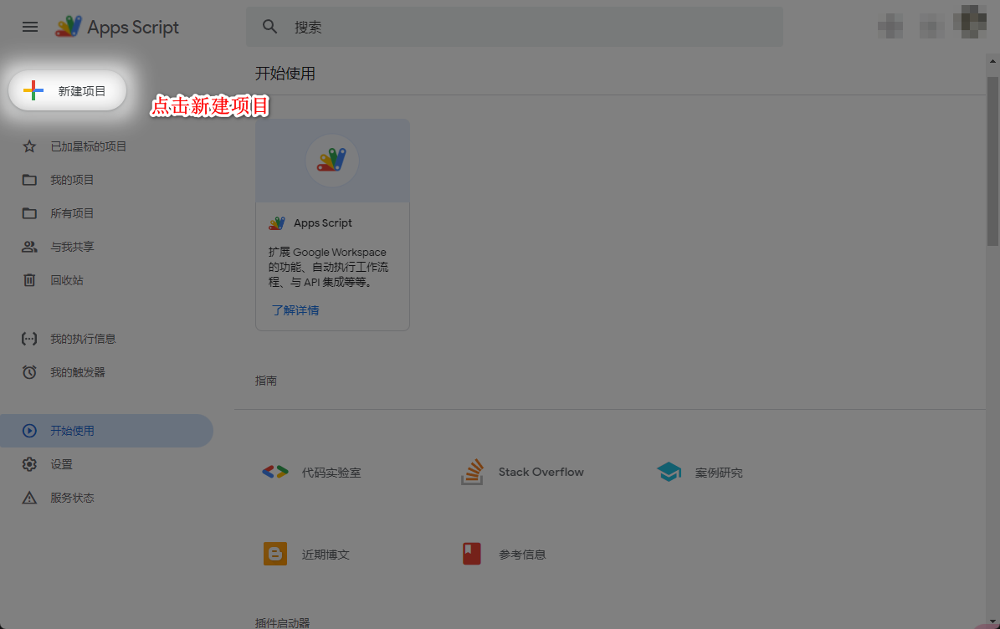

### 步骤 2、编辑脚本的代码

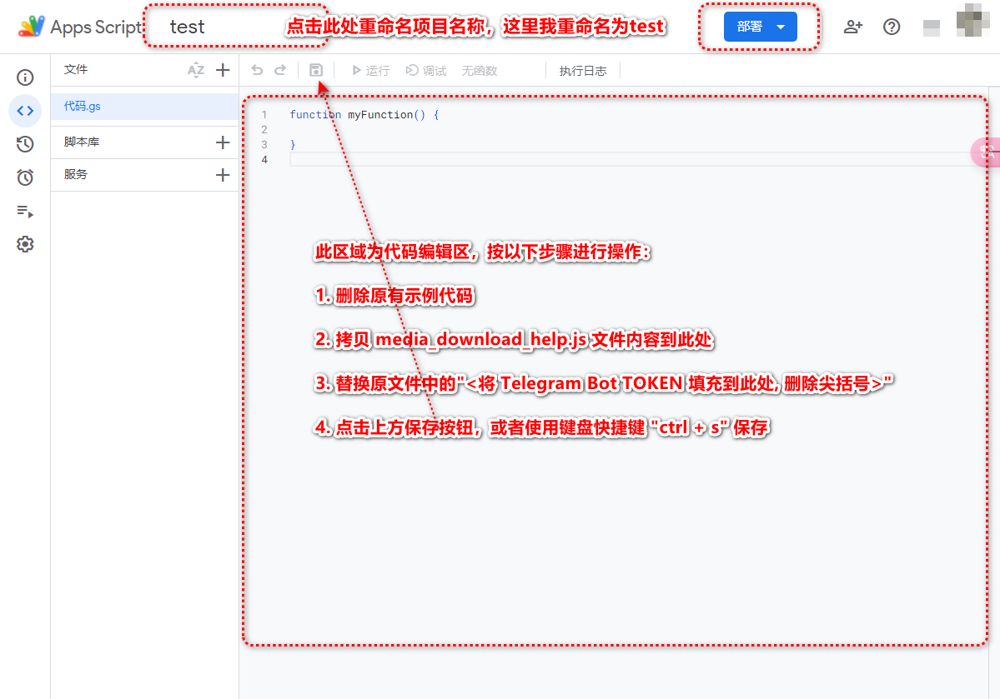

### 步骤 3、部署项目

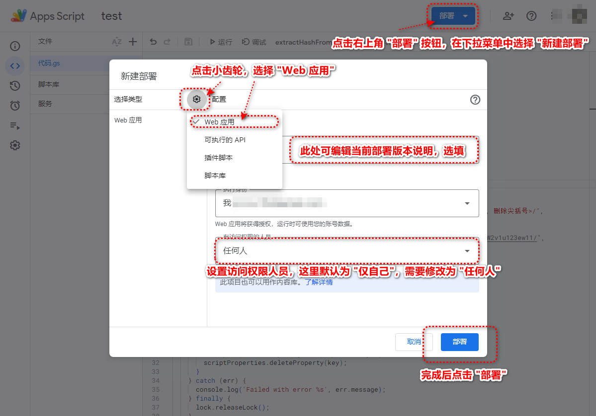

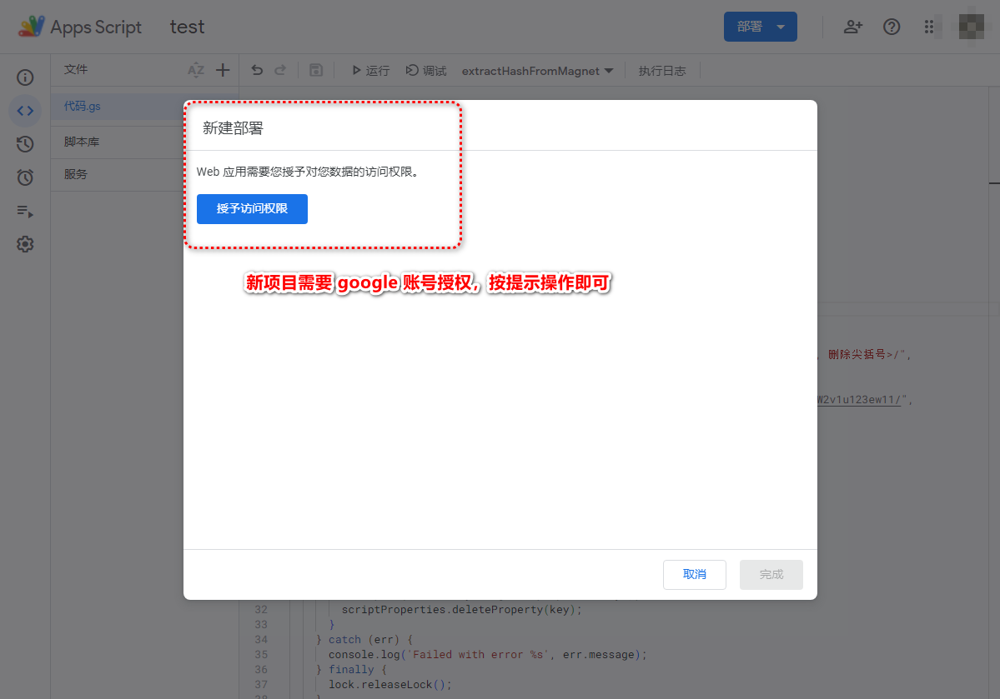

> 授权时可能会出现风险提示界面，估计是挂了代理的缘故，按下图操作继续即可。

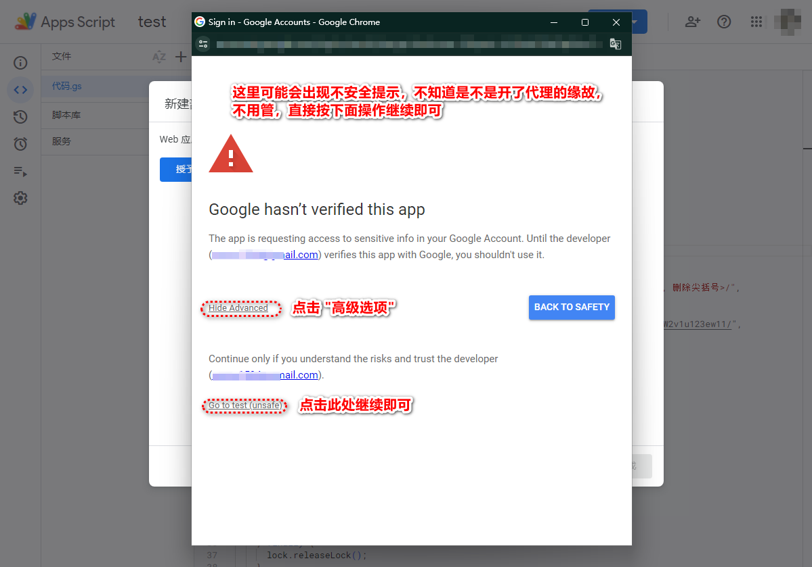

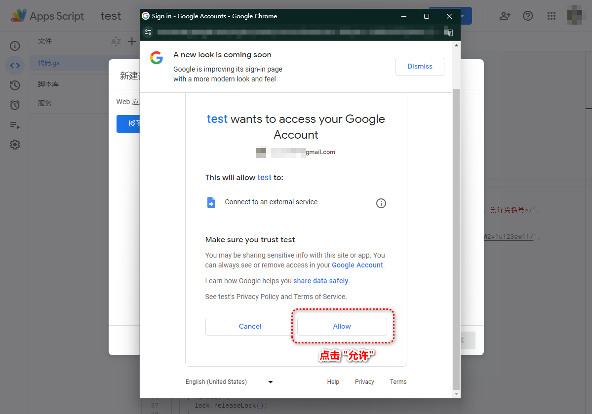

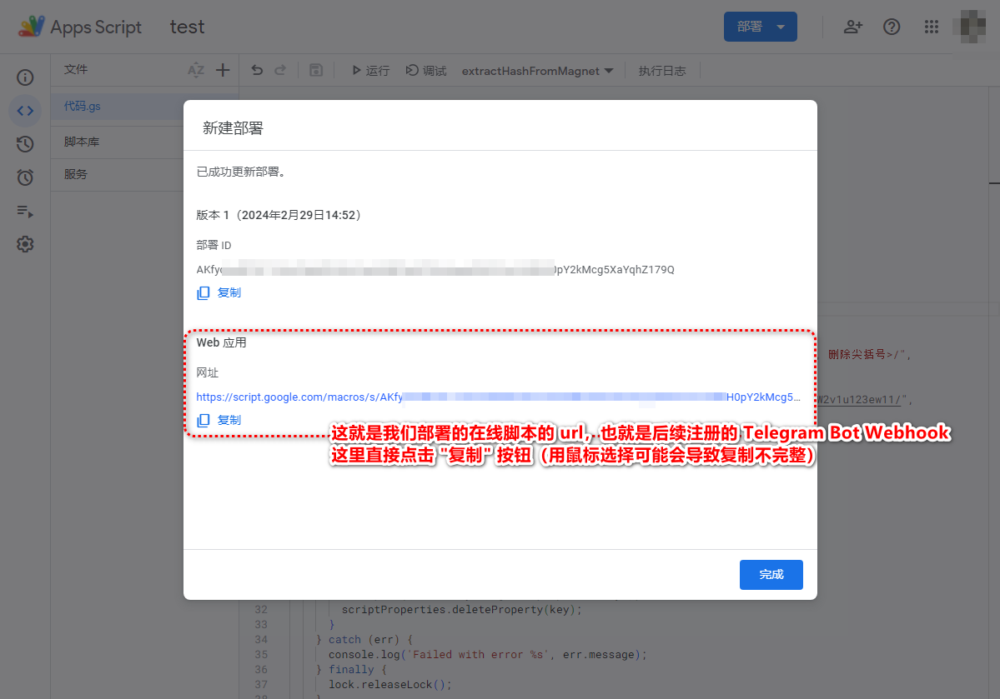

### 步骤 4、获取 Webhook URL

在上一步中，我们最终获取了一个 Web 应用的网址，我们可以直接将这个网址粘贴到浏览器地址栏进行访问，来验证部署是否成功，当显示 `{"status":"OK","magnet_urls":[]}` 时，表明已部署成功。 如下图所示：

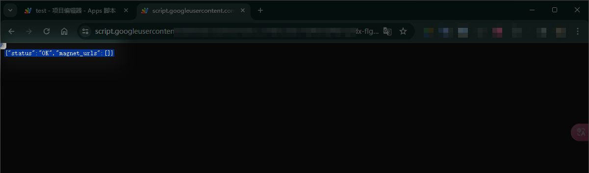

我们还需要对这个 Web Url 进行一些处理，打开这个 Url Encode 网站 [https://www.urlencoder.org/](https://www.urlencoder.org/)，将这个 url 进行编码，然后将编码后的 url 保存下来，后续会用。按下图操作即可：

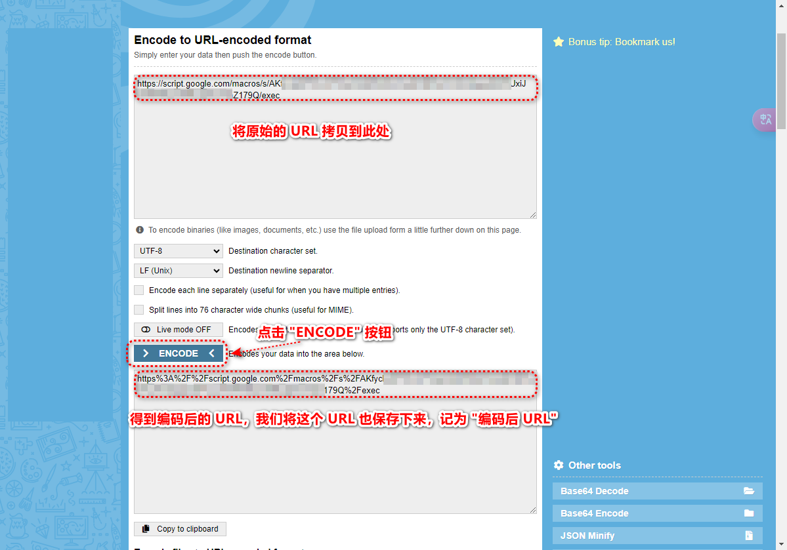

至此我们已经完成了 Google Apps Script 在线脚本的部署，我们在这里获得了一个 **"原始 URL"**，和一个 **"编码后 URL"**。

## 步骤 5、注册 Telegram bot Webhook

在这一步中，我们需要将上一步中获取到的 **"编码后 URL"** 注册到我们的 Telegram Bot 中，这样我们就可以通过 webhook 获取到用户发送的消息。

我们通过 Telegram Bot 的 API 来实现这个功能，这里用到两个 API，一个是 `setWebhook`，一个是 `getWebhookInfo`。

### 步骤 5.1、注册

我们使用 **"Bot TOKEN"**、**"编码后 URL"** 两个参数，按照以下格式完成 API 的组装：

~~~shell
# 将 {Bot TOKEN} 替换为你的 Bot TOKEN
# 将 {编码后 URL} 替换为你的 编码后 URL
https://api.telegram.org/bot{Bot TOKEN}/setWebhook?url={编码后 URL}
~~~

然后将这个组装后的 url 粘贴到浏览器地址栏中进行访问，如果返回 `{"ok":true,"result":true,"description":"Webhook was set"}`，则表示注册成功。如下图所示：

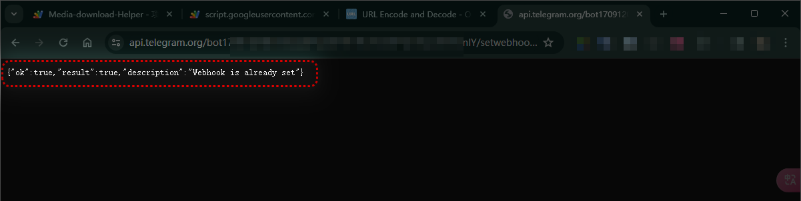

### 步骤 5.2、验证

我们可以通过 `getWebhookInfo` API 来验证是否注册成功，组装后的 url 如下：

~~~shell
# 将 {Bot TOKEN} 替换为你的 Bot TOKEN
https://api.telegram.org/bot{Bot TOKEN}/getWebhookInfo
~~~

然后将这个组装后的 url 粘贴到浏览器地址栏中进行访问，可以在返回结果中看到注册的 url，如下图所示：

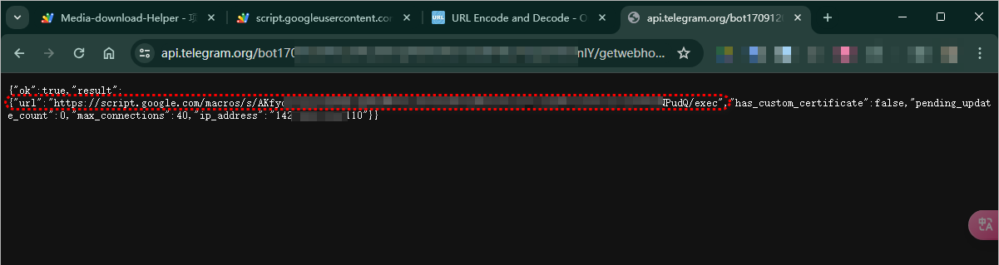

可以将图中红框部分的 URL 与我们在 **步骤 4** 中获取到的 **"原始 URL"** 进行对比，如果一致，则表示注册成功。

## 基于 docker 部署 Media-Download-Helper

 